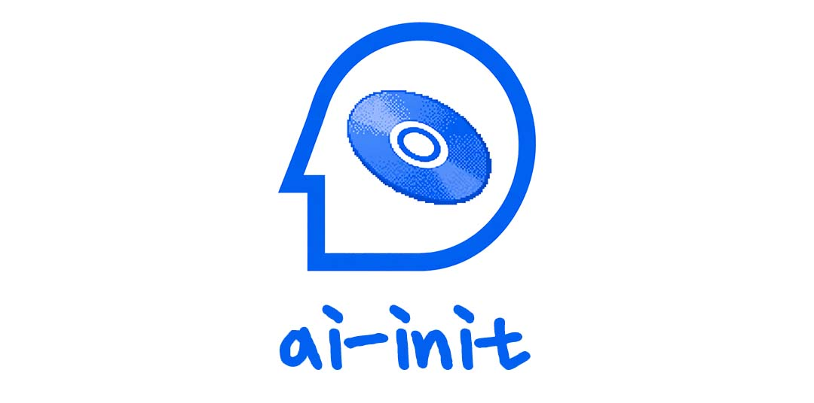

# ai-init

[English](README.md)

`ai-init`은 Codex 프로젝트를 위한 markdown-first 운영 레이어입니다.

긴 AI 코딩 세션에서 자주 무너지는 지점을 다룹니다. 작업 시작, 기능 추가, 버그 수정, context 복구, 세션 종료, branch 마무리를 durable project memory와 반복 가능한 lifecycle skill로 고정합니다.

목표는 단순합니다. 채팅 기록을 source of truth로 취급하지 않는 것입니다.

## 철학

`ai-init`은 몇 가지 명확한 선호를 기준으로 설계되어 있습니다.

- **기억보다 Markdown** - 현재 chat window가 아니라 project docs가 source of truth입니다.
- **작업 전에 복구** - 코드를 바꾸기 전에 agent가 context를 다시 확인해야 합니다.
- **기능 코드는 spec과 plan 이후** - 새 동작은 구현 전에 written target이 필요합니다.
- **수정 전에 재현** - bugfix는 추측이 아니라 evidence에서 시작합니다.
- **세션 종료 전에 Git evidence** - handoff와 commit 판단은 실제 diff에서 나와야 합니다.
- **작고 되돌리기 쉬운 변경** - 넓은 rewrite보다 좁고 review 가능한 단계를 선호합니다.
- **Optional integration은 optional로 유지** - public core는 Obsidian, hosted service, private tooling 없이 동작합니다.

## Skill Map

이 repository를 설치하면 다음 Codex skill을 사용할 수 있습니다.

| Skill | Purpose |
| --- | --- |
| `$ai-init` | durable AI working docs를 만들고 다음 Codex prompt를 출력합니다. |
| `$ai-init-session-recovery` | markdown docs와 live workspace evidence에서 현재 context를 복구합니다. |
| `$ai-init-start-work` | 작업 시작 전에 Git 상태와 branch/lane을 정리합니다. |
| `$ai-init-feature-addition` | 기능 요청을 code 전에 spec과 implementation plan으로 바꿉니다. |
| `$ai-init-bugfix` | 기존 동작의 문제를 재현, 진단, 수정, 검증합니다. |
| `$ai-init-session-close` | Git evidence를 바탕으로 세션을 닫고 다음 세션 handoff를 남깁니다. |
| `$ai-init-finish-work` | stage, commit, push, merge 가능 여부를 검증된 상태에서 판단합니다. |

## 빠른 시작

```sh
git clone https://github.com/noisyhaus/ai-init.git
cd ai-init
./install.sh
```

그 다음 초기화하려는 프로젝트에서 Codex를 열고 아래를 실행합니다.

```text
$ai-init
```

또는 lifecycle skill을 직접 실행할 수 있습니다.

```text
$ai-init-start-work
$ai-init-feature-addition
$ai-init-bugfix
$ai-init-session-recovery
$ai-init-session-close
$ai-init-finish-work
```

## 작동 방식

`ai-init`은 대상 프로젝트 안에 가벼운 문서 scaffold를 만드는 것부터 시작합니다. 이 scaffold는 코딩 에이전트가 매 세션마다 같은 프로젝트 정보를 다시 추측하지 않도록, durable한 작업 표면을 제공합니다.

그 다음 skill들이 다음 lifecycle을 제공합니다.

1. `ai-init`으로 프로젝트를 bootstrap합니다.
2. 구현 전에 markdown source-of-truth 파일에서 context를 복구합니다.
3. Git 상태를 확인하고 올바른 작업 lane을 선택해 작업을 시작합니다.
4. 기능 작업은 코드 작성 전에 spec과 plan을 만듭니다.
5. bugfix는 context 복구, 재현, 진단, 수정, 검증 순서로 진행합니다.
6. 세션 종료는 기억이 아니라 실제 Git evidence를 기준으로 합니다.
7. 작업 마무리는 무엇을 stage, commit, push, merge할 수 있는지 판단합니다.

public core는 의도적으로 plain markdown만 사용합니다. database, hosted service, private note-taking dependency가 없습니다.

## 설치

현재 `ai-init`은 source distribution을 우선합니다.

repository를 clone합니다.

```sh
git clone https://github.com/noisyhaus/ai-init.git
cd ai-init
```

checkout에서 public package를 설치합니다.

```sh
./install.sh
```

이 스크립트는 다음 install link를 로컬에 만듭니다.

- `~/.codex/skills/ai-init`
- `~/.codex/skills/ai-init-start-work`
- `~/.codex/skills/ai-init-feature-addition`
- `~/.codex/skills/ai-init-bugfix`
- `~/.codex/skills/ai-init-session-recovery`
- `~/.codex/skills/ai-init-session-close`
- `~/.codex/skills/ai-init-finish-work`
- `~/.local/bin/ai-init`

자세한 내용은 [docs/install.md](docs/install.md)를 보세요.

## 기본 사용법

초기화하려는 프로젝트에서 Codex를 시작한 뒤 현재 상황에 맞는 entrypoint를 사용합니다.

```text
$ai-init
```

설치된 bootstrap skill이 로컬 `ai-init` 명령을 대신 호출합니다. skill은 Codex 진입점이고, command는 고정된 scaffold 생성기입니다.

함께 설치되는 direct lifecycle skill:

- `$ai-init-start-work`
- `$ai-init-feature-addition`
- `$ai-init-bugfix`
- `$ai-init-session-recovery`
- `$ai-init-session-close`
- `$ai-init-finish-work`

필요하면 CLI를 직접 실행할 수도 있습니다.

```sh
ai-init
```

새 프로젝트라면:

```sh
ai-init --new-project
```

기존 프로젝트라면:

```sh
ai-init --existing-project
```

선택 scaffold:

```sh
ai-init --with-rules
ai-init --with-memory-plus
ai-init --with-local-recall
```

후속 prompt만 출력하려면:

```sh
ai-init --print-prompt
```

## 생성되는 파일

core scaffold는 세 개의 markdown source-of-truth 파일을 중심으로 구성됩니다.

- `docs/ai/project_memory.md` - 프로젝트 정체성, architecture note, canonical source, invariant를 저장합니다.
- `docs/ai/change_playbook.md` - 프로젝트별 변경 규칙, 검증 기대치, 작업 convention을 저장합니다.
- `docs/ai/current_state.md` - 현재 목표, 검증된 상태, risk, 다음 action, handoff 상태를 저장합니다.

그 외에 다음을 생성합니다.

- `AGENTS.md`
- `README.md`
- `docs/ai/handoffs/`
- `docs/ai/tasks/`
- `docs/adr/`
- `docs/superpowers/specs/`
- `docs/superpowers/plans/`

선택 scaffold는 다음을 추가할 수 있습니다.

- `docs/ai/rules/`
- `docs/ai/agent_memory.md`
- `docs/ai/user_preferences.md`
- `.ai-index/`
- `scripts/ai-index.py`

## 기본 Workflow

처음 사용하는 사람의 흐름:

```text
+----------------------------+
| 1. noisyhaus/ai-init clone |
+-------------+--------------+
              |
              v
+----------------------------+
| 2. ./install.sh 실행       |
+-------------+--------------+
              |
              v
+----------------------------+
| 3. cd target project       |
|    Codex 시작              |
+-------------+--------------+
              |
              v
+----------------------------+
| 4. 현재 lane에 맞는       |
|    skill command 입력     |
+-------------+--------------+
              |
              v
+----------------------------+
| 5. skill이 local ai-init   |
|    scaffold 실행           |
+-------------+--------------+
              |
              v
+----------------------------+
| 6. 출력된 prompt 또는     |
|    direct lane으로 진행    |
+----------------------------+
```

설치되는 public command:

- `$ai-init` - starter docs를 만들고 다음 Codex prompt를 출력합니다.
- `$ai-init-session-recovery` - 구현 전에 context를 복구합니다.
- `$ai-init-start-work` - Git 상태를 확인하고 올바른 lane을 준비합니다.
- `$ai-init-feature-addition` - coding 전에 spec과 plan artifact를 만듭니다.
- `$ai-init-bugfix` - regression을 재현, 진단, 수정, 검증합니다.
- `$ai-init-session-close` - Git evidence를 기준으로 session을 닫습니다.
- `$ai-init-finish-work` - 무엇을 stage, commit, push, merge할 수 있는지 판단합니다.

자세한 lifecycle contract는 [docs/skill-contracts.md](docs/skill-contracts.md)를 보세요.

## 구성

### CLI

- `bin/ai-init` - 프로젝트 문서와 planning folder를 생성하는 idempotent scaffold generator입니다.
- `install.sh` - public skill과 local CLI를 stable symlink로 설치합니다.
- `uninstall.sh` - repository checkout은 남기고 public install target만 제거합니다.
- `prompts/` - 새 프로젝트, 기존 프로젝트, feature addition, session recovery, session close용 follow-up prompt입니다.
- `templates/` - downstream 프로젝트에 생성되는 file template입니다.

### Skills

- `skills/ai-init/` - bootstrap skill과 shared lifecycle reference입니다.
- `skills/ai-init-*/` - shared reference를 감싸는 direct public lifecycle skill입니다.

### Docs

- [docs/install.md](docs/install.md)
- [docs/skill-contracts.md](docs/skill-contracts.md)
- [docs/superpowers-compatibility.md](docs/superpowers-compatibility.md)
- [USAGE.md](USAGE.md)

## Superpowers Compatibility

Superpowers는 필수가 아닙니다.

feature-addition lifecycle은 markdown-compatible spec/plan layout을 사용합니다.

- `docs/superpowers/specs/`
- `docs/superpowers/plans/`

프로젝트가 이미 Superpowers를 사용한다면 `ai-init`은 같은 문서 layout을 공유할 수 있습니다. 사용하지 않는 프로젝트에서도 workflow는 plain markdown file만으로 동작합니다. Superpowers-specific behavior는 public core의 hard dependency가 아니라 optional adapter로 남아야 합니다.

## Maintainer Workflow

변경사항을 publish하기 전에 검증을 실행합니다.

```sh
./tests/install-script-test.sh
./tests/ai-init-output-test.sh
git diff --check
rg -n "\p{Hangul}" . -g '!README.ko.md'
rg -n -i "o[b]sidian|w[i]ki|with-w[i]ki|w[i]ki-sync|w[i]ki-hook" .
```

release tag는 semantic versioning을 사용합니다.

```sh
git tag v0.1.0
git push origin v0.1.0
```

추천 release note section:

- Added
- Changed
- Fixed
- Migration

## Repository Boundary

이 repository에는 `ai-init`을 설치, 검토, 테스트, release하는 데 필요한 public source만 둡니다.

- `templates/*`는 downstream user project에 생성되는 file입니다.
- `skills/ai-init/`은 배포 가능한 skill source입니다.
- root `AGENTS.md`, `docs/ai/*`, `docs/superpowers/specs|plans/*`는 이 repository의 local development state이므로 의도적으로 ignore합니다.
- `~/.codex/skills` 아래 설치된 local copy는 runtime copy이며 release source of truth가 아닙니다.

이 repository root에서 `ai-init --force`를 실행하지 마세요. scaffold behavior는 temporary directory나 fixture project에서 테스트하세요.

## Status

이 repository는 `ai-init`의 public source package입니다. clone해서 설치하고, `git pull`로 업데이트하고, checkout 경로를 옮겼다면 다시 설치하면 됩니다.

## License

MIT License입니다. 자세한 내용은 [LICENSE](LICENSE)를 보세요.
